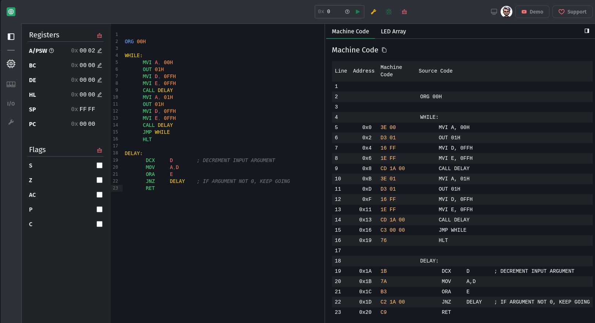

# Sim8085

[](https://github.com/debjitbis08/sim8085/blob/main/LICENSE) [](https://www.sim8085.com) [](https://github.com/debjitbis08/sim8085/stargazers)

Sim8085 is a modern web-based development environment for the Intel 8085 microprocessor. It includes a graphical editor, assembler, and debugger designed to help students, educators, and enthusiasts explore 8085 assembly programming.

🖥️ Try it now at [sim8085.com](https://www.sim8085.com)

---

## ✨ Features

- 📝 **Syntax-highlighted editor** for writing 8085 assembly code.
- 🐞 **Interactive debugger** with:
    - Step-by-step execution
    - Flag and register updates
    - Visual memory inspection
- ⚙️ **Assembler with smart error messages**, help fix common problems quickly.
- 🚄 **Near-native performance**, powered by a C-based simulator compiled to highly optimized JavaScript via Emscripten.
- ⏱️ **Instruction Timing Mode** to simulate real-time delays.
- ♾️ **Supports long-running programs** (e.g., waveform generators or infinite loops), safely handled in-browser.
- 🧠 **Interrupt system** that closely matches how the 8085 handles interrupts.
- 📱 **Mobile-friendly** and works great in modern mobile browsers.
- 💾 **Offline support**: Once loaded, Sim8085 continues to work even without an internet connection thanks to full PWA support.
- 📦 **Installable as an app**: Add Sim8085 to your home screen or desktop like a native app—no App Store needed.

---

## 🖼️ Screenshot



---

## 🛠️ Development Setup

### 📦 Requirements

- [Emscripten SDK](https://emscripten.org/docs/getting_started/downloads.html)
- Node.js ≥ 22.x and [pnpm](https://pnpm.io)

### 🚧 Steps

1. **Install Emscripten** (follow [official instructions](https://emscripten.org/docs/getting_started/downloads.html)). You need this only if you are working on the instruction simulator code (`src/core/8085.c`).
2. Clone this repo and install dependencies:

    ```bash
    pnpm install
    ```

3. Start the development server:

    ```bash
    pnpm dev
    ```

---

### 🔧 Building the Emulator (C to JS)

If you make changes in `src/core/8085.c`:

1. Build the updated simulator:

    ```bash
    pnpm build-emulator
    ```

2. Commit the modified JS file.

---

### 🚀 Production Build

1. Make sure the emulator is built:

    ```bash
    pnpm build-emulator
    ```

2. Build the frontend:

    ```bash
    pnpm build
    ```

3. Final output will be in the `dist/` directory.

---

## 💖 Support Sim8085

Sim8085 is a free and open-source project built with care to help students and educators learn 8085 programming with ease. If you find it useful and would like to support its continued development, consider donating:

- 🙌 [GitHub Sponsors](https://github.com/sponsors/debjitbis08)
- ☕ [Buy Me a Coffee](https://buymeacoffee.com/debjit.biswas)
- 💙 [Ko-fi](https://ko-fi.com/debjitbiswas)

Your support helps cover hosting, development time, and the addition of new features. Every little bit counts!

---

&copy; 2013-present [Debjit Biswas](https://www.debjitbiswas.com). BSD-3-Clause License.
