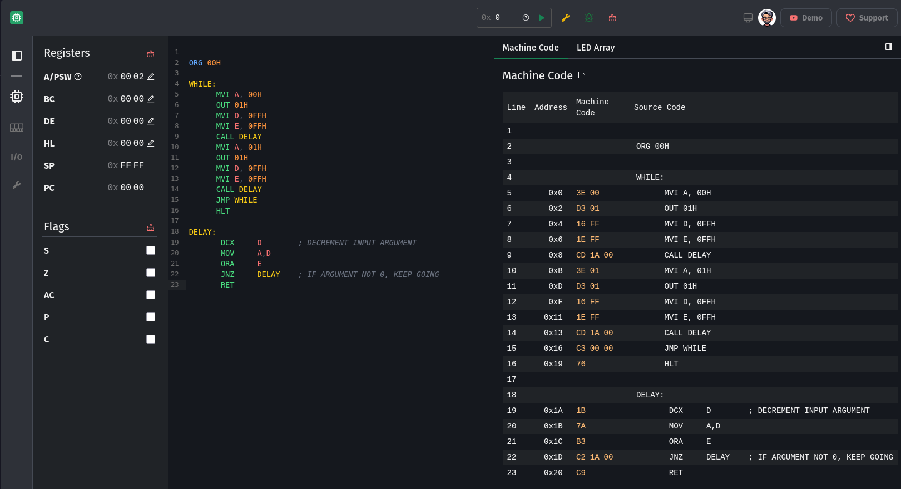

# Sim8085

[](https://github.com/debjitbis08/sim8085/blob/master/LICENSE) [](https://www.sim8085.com) [](https://github.com/debjitbis08/sim8085/stargazers)

Sim8085 is a modern web-based development environment for the Intel 8085 microprocessor. It includes a graphical editor, assembler, and debugger designed to help students, educators, and enthusiasts explore 8085 assembly programming.

🖥️ Try it now at [sim8085.com](https://www.sim8085.com)

---

## ✨ Features

- 📝 **Syntax-highlighted editor** for writing 8085 assembly code.
- 🐞 **Interactive debugger** with:
    - Step-by-step execution
    - Flag and register updates
    - Visual memory inspection
- ⚙️ **Assembler with smart error messages**, help fix common problems quickly.
- 🧠 **Interrupt system** that closely matches how the 8085 handles interrupts.
- ♾️ **Supports long-running programs** (e.g., waveform generators or infinite loops), safely handled in-browser.
- ⏱️ **Instruction Timing Mode** to simulate real-time delays.
- 🧹 **Built-in code formatter** that aligns mnemonics, operands, and comments into neatly spaced columns.
- 🚄 **Near-native performance**, powered by a C-based simulator compiled to highly optimized JavaScript via Emscripten.
- 📱 **Mobile-friendly** and works great in modern mobile browsers.
- 💾 **Offline support**: Once loaded, Sim8085 continues to work even without an internet connection thanks to full PWA support.
- 📦 **Installable as an app**: Add Sim8085 to your home screen or desktop like a native app, no App Store needed.

---

## 🎯 Accuracy and CPU Validation

Sim8085 is tested against independent, external references rather than only
against its own expectations. Everything below is reproducible from a clean
checkout with `pnpm test`. A fuller write-up, including what each suite
actually proves, is in the docs:
[Accuracy and CPU Validation](https://www.sim8085.com/docs/en/accuracy/).

| Validation | Coverage | Status |
| --- | --- | --- |
| Instruction unit tests | 8085 semantics and flags, per mnemonic | Pass |
| Opcode inventory | All 256 opcode bytes, cross-checked against the C dispatch | Pass |
| Timing tests | T-states for every opcode (199 documented, 47 control-flow, 10 undocumented) | Pass |
| [8080PRE](src/tests/exerciser) | Preliminary 8080/8085 exerciser (Cringle, Bartholomew) | Pass |
| [TST8080](src/tests/exerciser) | 8080/8085 CPU Diagnostic v1.0 (Microcosm Associates, 1980) | Pass |
| [CPUTEST](src/tests/exerciser) | Diagnostics II v1.2 CPU test (SuperSoft, 1981) | Pass |
| [8080EXM](src/tests/exerciser) | Full instruction exerciser, ~2.9 billion instructions | 25/25 CRC groups |
| SDK-85 monitor ROM | Assembles byte-for-byte against Intel's own object code | Pass |
| SDK-85 boot | Intel's complete monitor boots from reset and reaches its idle loop | Pass |
| SDK-85 interrupts | TRAP, RST 5.5/6.5/7.5, EI, SIM, RIM | Pass |
| Differential testing against physical 8085 silicon | Not performed | Not claimed |

### What the exercisers add

The unit tests assert on cases we thought to write down. The CP/M exercisers
walk the operand space and CRC the entire machine state after every
instruction, comparing against CRCs captured from real hardware — a single
wrong flag in a single addressing mode changes the result.

This is not theoretical: the exercisers found two real `DAA` defects on their
first run, in an instruction the unit tests already covered. See
[src/tests/exerciser/README.md](src/tests/exerciser/README.md) for the full
account, ROM provenance and checksums.

Because the ROMs were written for the 8080 and CRC the whole PSW byte, the
harness enables a documented 8080 compatibility mode for the flag bits where
the 8085 legitimately differs. The browser simulator always uses 8085
behaviour.

### Reproducing it

```sh
pnpm test                                          # everything except 8080EXM (~seconds)
RUN_8080EXM=1 npx vitest run src/tests/exerciser   # adds the exhaustive run (~35s)
```

`8080EXM` is opt-in only because of its runtime, not because it is expected to
fail.

### What is not claimed

Undocumented 8085 instructions (`DSUB`, `ARHL`, `RDEL`, `LDHI`, `LDSI`,
`RSTV`, `SHLX`, `LHLX`, `JX5`/`JNX5`) and the K/V flags are implemented and
tested, but their expected behaviour comes from documentation and community
reverse-engineering rather than from hardware measurement — no 8080 exerciser
can cover instructions the 8080 does not have. Corrections backed by silicon
are very welcome.

---

## 🖼️ Screenshot



---

## 🛠️ Development Setup

### 📦 Requirements

- [Emscripten SDK](https://emscripten.org/docs/getting_started/downloads.html)
- Node.js ≥ 22.x and [pnpm](https://pnpm.io)

### 🚧 Steps

1. **Install Emscripten** (follow [official instructions](https://emscripten.org/docs/getting_started/downloads.html)). You need this only if you are working on the instruction simulator code (`src/core/8085.c`).
2. Clone this repo and install dependencies:

    ```bash
    pnpm install
    ```

3. Start the development server:

    ```bash
    pnpm dev
    ```

---

### 🔧 Building the Emulator (C to JS)

If you make changes in `src/core/8085.c`:

1. Build the updated simulator:

    ```bash
    pnpm build-emulator
    ```

2. Commit the modified JS file.

---

### 🚀 Production Build

1. Make sure the emulator is built:

    ```bash
    pnpm build-emulator
    ```

2. Build the frontend:

    ```bash
    pnpm build
    ```

3. Final output will be in the `dist/` directory.

---

## 💖 Support Sim8085

Sim8085 is a free and open-source project built with care to help students and educators learn 8085 programming with ease. If you find it useful and would like to support its continued development, consider donating:

- 🙌 [GitHub Sponsors](https://github.com/sponsors/debjitbis08)
- ☕ [Buy Me a Coffee](https://buymeacoffee.com/debjit.biswas)
- 💙 [Ko-fi](https://ko-fi.com/debjitbiswas)

Your support helps cover hosting, development time, and the addition of new features. Every little bit counts!

---

&copy; 2013-present [Debjit Biswas](https://www.debjitbiswas.com). BSD-3-Clause License.
