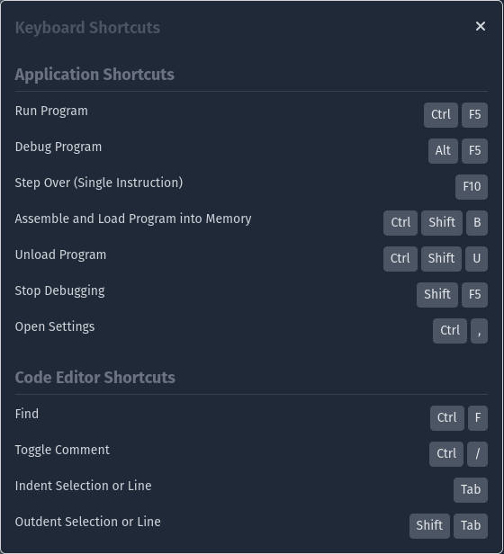
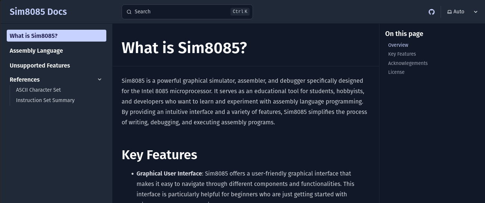

### Keyboard shortcuts are here!

Use your keyboard to assemble, run, and control other parts of the application.

### Add documentation page

Sim8085 now has a [documentation section](/docs/en). Documents about Sim8085 and
8085 microprocessor in general will be available in this section.

### Support for END Directive

The `END` directive is used for marking the end of assembling process
and to set the starting address to start execution. [Read the docs](/docs/en/directives/end).
