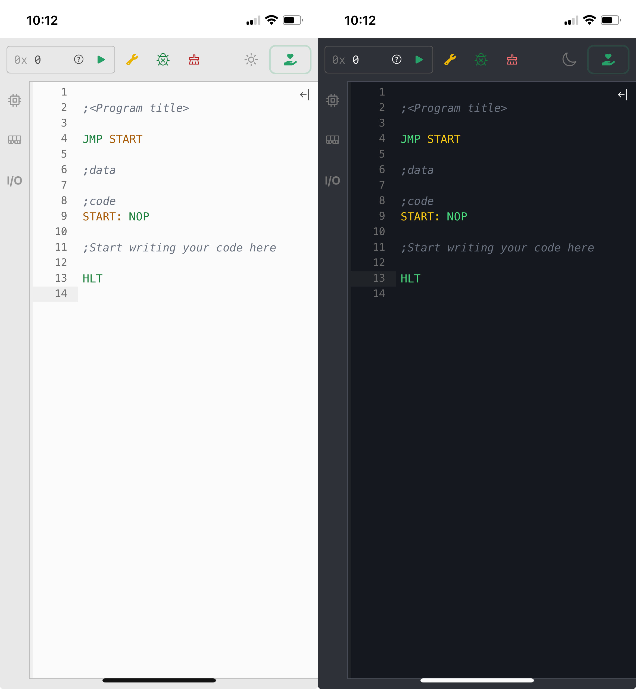
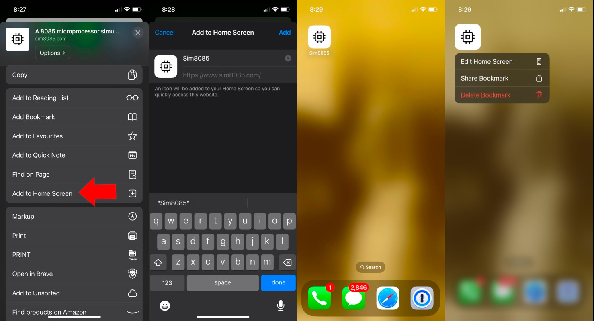
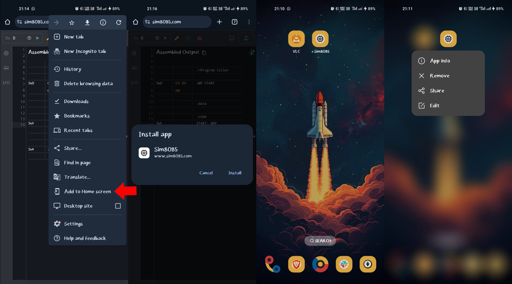

---
versions:
    - "2.2.0"
    - "2.2.1"
    - "2.3.0"
    - "2.3.1"
    - "2.3.2"
    - "2.3.3"
date: "2024-11-16"
---

### Mobile & Offline Support Has Arrived!

Sim8085 is now more accessible than ever! Use it seamlessly on your mobile device or desktop, whether you're online or offline.

### What’s New?

- **Mobile-Friendly**: Run Sim8085 on your phone to quickly try out programs, learn, and experiment with 8085 assembly programming—anytime, anywhere.
- **Offline Access**: Enjoy Sim8085 even without an internet connection. Yes, you could technically debug an assembly program on a plane (not that you’d want to… or would you?).
- **Installable as an App**: Add Sim8085 to your home screen or desktop and use it like a native app for a smoother experience.

### How to Install

- **On iOS**:
    1. Open [https://www.sim8085.com](https://www.sim8085.com) in Safari.
    2. Tap the **Share** icon and select **Add to Home Screen**.

- **On Android**:
    1. Open [https://www.sim8085.com](https://www.sim8085.com) in your browser.
    2. Tap the menu (three dots) and select **Add to Home Screen** or **Install App**.

- **On Desktop**:
    1. Open [https://www.sim8085.com](https://www.sim8085.com).
    2. Look for the **Install** option in your browser's URL bar.

For detailed instructions, check out Mozilla’s [Installing and Uninstalling Web Apps](https://developer.mozilla.org/en-US/docs/Web/Progressive_web_apps/Guides/Installing) guide.
