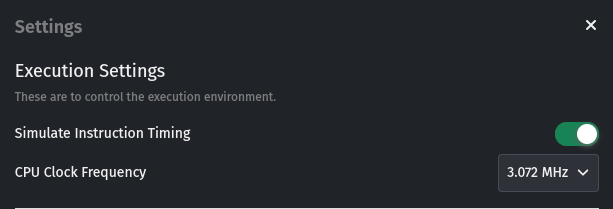
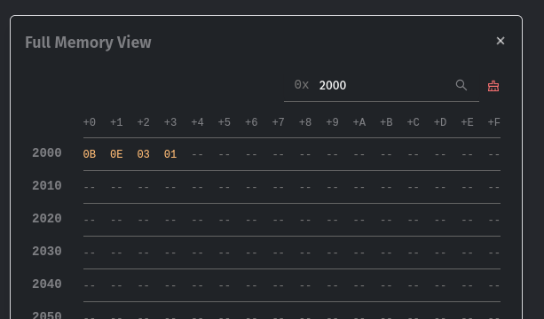

---
versions:
    - "2.9.0"
date: "2025-05-03"
---

### ✨ Added Support for Long-Running Programs

Sim8085 can now handle programs with infinite loops, such as those that generate square waves:

```asm
ORG 00H

WHILE:
      MVI A, 00H
      OUT 02H
      MVI D, 0FFH
      MVI E, 0FFH
      CALL DELAY
      MVI A, 01H
      OUT 02H
      MVI D, 0FFH
      MVI E, 0FFH
      CALL DELAY
      JMP WHILE
      HLT

DELAY:
       DCX     D
       MOV     A,D
       ORA     E
       JNZ     DELAY
       RET
```

Previously, such programs could freeze the browser due to tight loops. This update introduces **Instruction Timing Mode**, a new simulator setting that emulates instruction execution delays more realistically.



When enabled, the simulator inserts delays based on actual 8085 timing, allowing the host browser to remain responsive — even for infinite or long-running loops.

> **Note**: Instruction Timing Mode is **off by default**. You must enable it before running time-sensitive or infinite loop programs.

This lays the groundwork for exciting features like:

- Interactive programs (e.g., waiting for keyboard input)
- Monitor programs that rely on polling loops
- Realistic peripheral emulation in future updates

---

### 🛠️ Minor Fixes

- When using the **Full Memory View**, searched rows now appear at the **top** of the view instead of the bottom — making them easier to find.


