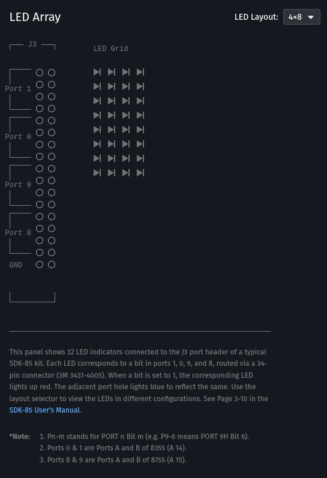
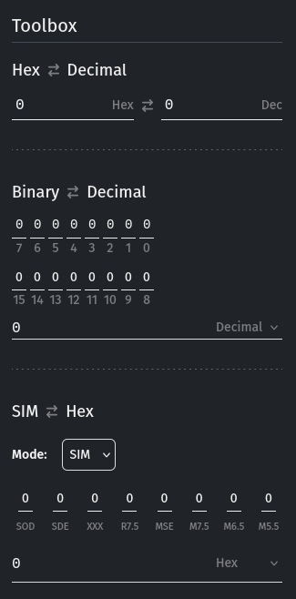

---
versions:
    - "2.11.2"
    - "2.11.1"
    - "2.11.0"
    - "2.10.3"
    - "2.10.2"
    - "2.10.1"
    - "2.10.0"
date: "2025-05-05"
---

### 💡 LED Array Connected to J3

Sim8085 now includes a **virtual LED Array** connected to **port J3**, letting you simulate LED output visually:

```asm
MVI A, 55H
OUT 03H ; lights up alternating LEDs
HLT
```

This is perfect for writing I/O programs that display patterns or signals, such as binary counters or blinking sequences.



---

### 🧰 New Toolbox Panel

Introducing the **Toolbox Panel** — a handy sidebar with utilities to help you convert and inspect values while programming.

It currently includes:

- **Hex ⇄ Decimal Converter**
- **Binary ⇄ Decimal Converter**
- **SIM ⇄ Hex Helper** to visualize SIM instruction bits



> This is just the beginning — more tools are planned for upcoming releases.

---

### ⚡ Performance Improvements

- Improved loading performance with smarter asset loading
- Removed unused Google Fonts to reduce page size

---

### 🐞 Bug Fixes

#### 📱 Mobile Layouts

- Fixed layout of the **Actions** panel on small screens
- Reordered icons in the Actions list for better clarity
- Fixed login page logo distortion on **iPhone Safari**
- Improved **changelog layout** on mobile screens

#### 🧱 General UI

- Fixed CSS build issues
- Corrected documentation path in sidebar
- Fixed Tips section styling for consistency

---

Let me know if you'd like to split these into separate posts for each major feature or keep them combined.
