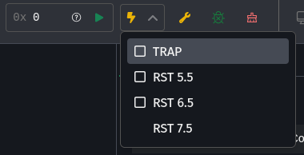
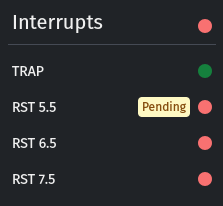

---
versions:
    - "2.13.0"
date: "2025-05-08"
---

### 🆕 Interrupt Controls & Indicators

Sim8085 now supports **realistic interrupt simulation** — not just the CPU behavior, but also the **hardware lines and pending states**:

- 🟡 **Interrupt Control Panel**
  You can now toggle **TRAP**, **RST 5.5**, **RST 6.5**, and **RST 7.5** lines from the new lightning bolt (⚡) menu — just like pressing hardware buttons. Each toggle represents the state of the actual interrupt line.

    

- 🟢 **Live Interrupt Status Panel**
  A new sidebar section displays the **enabled/masked state** of each interrupt, as well as any **pending interrupts**.
  TRAP is always enabled (as it is in real 8085), and RST 7.5 now includes proper **latch behavior**.

    

These improvements make it easier to understand and debug interrupt-driven programs — and bring Sim8085 even closer to how real 8085 hardware behaves.
