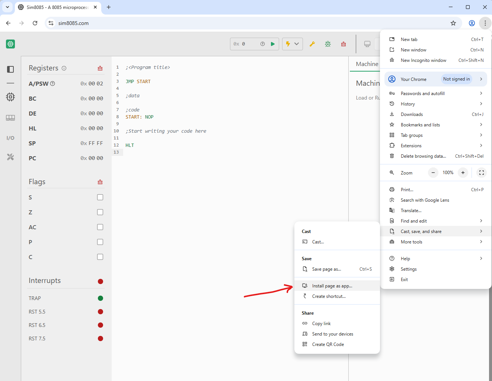
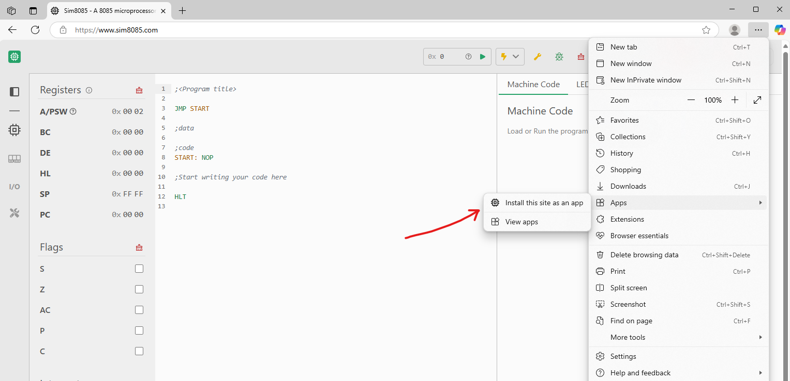

Sim8085 is a **Progressive Web App (PWA)**, which means you can install it like a native desktop application directly from your Chrome browser on Windows. Once installed, it behaves like a standalone app — with offline support, a cleaner UI, and faster load times.

* 🪟 A standalone window (no address bar or tabs)
* 🛫 Full offline access after installation
* 📌 Launch from Start Menu or taskbar
* ⚡ Faster access and cleaner experience

---

## 🧭 Option 1: Google Chrome (Windows)

### ✅ Steps

1. Open **Chrome** and go to [https://www.sim8085.com](https://www.sim8085.com).
2. Click the **three-dot menu** in the top-right corner of the browser.
3. Hover over **"Cast, save, and share"**.
4. Click **"Install page as app…"**
   *(as shown in the screenshot below)*

5. Confirm the prompt by clicking **Install**.
6. Sim8085 will launch in its own window, and you can pin it to the **taskbar**, **desktop**, or **Start menu**.

---

## 🧭 Option 2: Microsoft Edge (Windows)

### ✅ Steps

1. Open **Edge** and navigate to [https://www.sim8085.com](https://www.sim8085.com).
2. Click the **three-dot menu** in the top-right corner.
3. Go to **"Apps"** → **"Install this site as an app"**.

4. Click **Install** in the confirmation dialog.
5. Sim8085 will open in a new window. You’ll also find it listed in the Start Menu, and you can pin it to your taskbar or desktop.

---

## 📡 Offline Support

Once installed, Sim8085 will work **offline**. You can:

* Open and use it without internet.
* Load programs, edit, and simulate 8085 code offline.
* Updates will automatically apply when you're online next.

---

## 🧽 How to Uninstall

1. Right-click the **Sim8085** icon in your Start menu or taskbar.
2. Select **Uninstall** or **Remove from this device**.
3. Alternatively, open Chrome, go to `chrome://apps`, right-click Sim8085, and choose **Remove from Chrome**.

---

## 🔍 Need More Help?

See [Chrome's official PWA install guide](https://support.google.com/chrome/answer/9658361).

